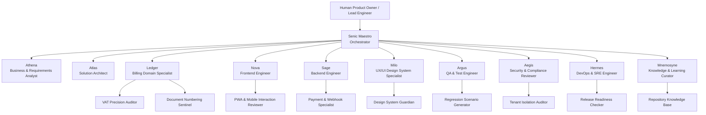

# Senic Billing Next Multi AI Agents System

ระบบนี้เป็น prototype สำหรับทีม Multi AI Agents ของ Senic Billing Next โดยออกแบบจากข้อมูลใน `docs/`, `README.md`, และโครงสร้างโค้ดจริงของ repository เพื่อให้ AI ทำหน้าที่เป็นผู้ช่วยวิเคราะห์ ออกแบบ พัฒนา ทดสอบ ตรวจความปลอดภัย ดูแล deployment และเรียนรู้จากงานที่ทำได้อย่างเป็นระบบ

## 1. Project Intelligence Summary

Senic Billing Next คือ Thai-first SaaS สำหรับ SME ไทยที่ออกเอกสารการเงิน 4 ประเภท ได้แก่ ใบกำกับภาษี, ใบเสร็จรับเงิน, บิลเงินสด และใบส่งของ ระบบปัจจุบันเป็น monorepo ที่แบ่ง frontend/backend ชัดเจน

### Product Domain

- Core documents: `TaxInvoice`, `Receipt`, `CashBill`, `DeliveryNote`
- Core business concerns: VAT 7%, Thai currency precision, running document numbers, tenant isolation, customer/product master data, payment status, PDF/print output
- Target users: SME operators and accounting users who need speed, clarity, Thai-language workflows, and reliable financial records
- UX direction: Thai-first copy, glassmorphism, dual theme `Warm Horizon` / `Deep Ocean`, mobile-first PWA behavior

### Technology Surface

- Frontend: React 19, TypeScript, Vite, Tailwind CSS v4, Zustand, React Router v7, Recharts, Lucide React
- Backend: .NET 10 ASP.NET Core Web API, EF Core 10, PostgreSQL, JWT, SignalR, MinIO, Omise payment integration
- Architecture: Clean Architecture with `Domain`, `Application`, `Infrastructure`, `API`
- Deployment: Docker, GitHub Actions, GHCR, Portainer webhook

### Critical Quality Rules

- Money fields must use exact decimal handling, matching backend `decimal(18,4)` and frontend Thai locale formatting.
- Every tenant-owned record must preserve `TenantId` isolation and must never leak cross-tenant data.
- Document numbers must remain unique and sequential per tenant, document type, and month.
- User-facing UI copy is Thai-first and should use Lucide icons instead of emoji.
- Frontend work must preserve the established dual-theme design system and mobile navigation patterns.
- Backend work must respect Clean Architecture boundaries and avoid putting infrastructure concerns into domain entities.

## 2. Agent Architecture Prototype

The system uses one orchestrator, specialist agents, and narrow subagents. The orchestrator owns routing and quality gates; specialists own professional judgment in their area; subagents perform focused checks or deep dives.



## 3. Primary Agents

| Agent | Mission | Owns | Must Not Own |
|---|---|---|---|
| Senic Maestro | Coordinate complex work end-to-end | Routing, task decomposition, dependency ordering, quality gates, handoffs | Writing detailed implementation without specialist review for risky work |
| Athena | Convert business needs into requirements | User stories, acceptance criteria, impact analysis, Thai SME workflows | Low-level code decisions |
| Atlas | Design architecture and contracts | Clean Architecture, API contracts, data model, ADRs, integration boundaries | Pixel-level UI polish |
| Ledger | Protect billing correctness | VAT rules, document lifecycle, payment state, numbering, financial invariants | Deployment mechanics |
| Sage | Build backend capability | Controllers, services, EF Core, JWT, SignalR, MinIO, Omise integration | Frontend visual design |
| Nova | Build frontend capability | React components, Zustand stores, API clients, PWA behavior, routing | Database migrations |
| Milo | Preserve product UX and visual system | Thai-first UX, dual theme, glassmorphism, layout, accessibility | Backend implementation |
| Argus | Prove behavior works | Test plans, unit/integration/E2E scenarios, regression coverage | Product prioritization |
| Aegis | Protect users and data | Auth, tenant isolation, OWASP, secrets, payment webhook validation | Cosmetic design |
| Hermes | Make delivery reliable | Docker, CI/CD, environments, observability, health checks | Business requirement authoring |
| Mnemosyne | Maintain living knowledge | Codebase index, lessons learned, patterns, decisions, skill updates | Approving product scope alone |

## 4. Specialist Subagents

Subagents are intentionally narrow so the orchestrator can request precise, low-noise outputs.

| Subagent | Trigger | Output |
|---|---|---|
| VAT Precision Auditor | Any VAT, discount, total, or payment amount change | Formula review, edge cases, rounding risks, test vectors |
| Document Numbering Sentinel | Any change to document creation or sequence table | Concurrency risk review, uniqueness checks, retry behavior |
| Tenant Isolation Auditor | Any API/query/entity touching tenant-owned data | Cross-tenant leak analysis, missing filters, authorization risks |
| Payment & Webhook Specialist | Omise, PromptPay, payment status, webhook changes | Idempotency plan, signature validation, event flow, failure modes |
| PDF & Print Specialist | A4 templates, export, print view, Thai document layout | Layout constraints, print CSS risks, legal/document formatting checklist |
| PWA & Mobile Interaction Reviewer | Offline, mobile nav, pull-to-refresh, installability | Mobile UX checklist, browser capability caveats, regression scenarios |
| Design System Guardian | Any frontend UI change | Token compliance, theme behavior, Thai copy, icon usage, accessibility |
| Release Readiness Checker | Deployment, CI/CD, Docker, env changes | Release checklist, rollback risks, missing secrets/config |
| Regression Scenario Generator | Before implementation or final validation | Minimal high-value test matrix tied to requirements |

## 5. Automated Coordination Model

Every non-trivial task follows a deterministic collaboration loop.

### Step 1: Intake

Maestro receives the request and creates a task brief:

- Goal
- Affected modules
- Risk level
- Required agents
- Validation commands
- Known docs/code anchors

### Step 2: Discovery

Maestro asks only the minimum agents needed to inspect the relevant surface:

- Athena for unclear business intent
- Atlas for architecture or API/data model risk
- Ledger for billing-domain invariants
- Milo/Nova/Sage for implementation surface
- Aegis/Argus/Hermes when security, test, or deployment risk exists

### Step 3: Plan

The orchestrator creates a small implementation plan with explicit quality gates:

- Requirement gate: acceptance criteria are testable
- Architecture gate: layer boundaries and contracts are clear
- Implementation gate: smallest safe change path is identified
- Verification gate: build/test/lint/manual checks are named before coding
- Learning gate: lessons and decisions are captured after validation

### Step 4: Execute

Implementation agents work in narrow slices:

- Sage handles backend files under `backend/src/**`
- Nova handles frontend files under `frontend/src/**`
- Milo reviews UI/UX deltas before finalizing frontend work
- Ledger/Aegis run targeted reviews for financial/security-critical changes

### Step 5: Validate

Argus coordinates verification:

- Frontend: `cd frontend && npm run build` or `npm run lint` for UI changes
- Backend: `cd backend && dotnet build SenicBilling.slnx` for API/domain/infrastructure changes
- Docker/deploy: validate `docker-compose.yml`, Dockerfiles, and workflow syntax as applicable
- Financial logic: use fixed VAT and rounding test vectors
- Tenant isolation: test same endpoint with different tenant claims/data where possible

### Step 6: Learn

Mnemosyne updates living knowledge:

- Add or update codebase index entries
- Promote repeated fixes into patterns
- Record architecture decisions as ADRs
- Mark outdated assumptions for removal
- Add regression cases when a bug is found

## 6. Handoff Protocol

Agents communicate through structured handoff notes so work can continue across chats or subagents.

```yaml
handoff:
  task_id: SENIC-YYYYMMDD-short-name
  goal: "One sentence outcome"
  status: planned | in_progress | blocked | validated | done
  affected_paths:
    - backend/src/SenicBilling.API/Controllers/...
    - frontend/src/components/...
  agents_consulted:
    - atlas
    - ledger
    - aegis
  decisions:
    - "Decision with reason and rejected alternative"
  risks:
    - "Risk, likelihood, mitigation"
  validation:
    commands_run:
      - "cd frontend && npm run build"
    remaining_checks:
      - "Manual payment webhook test with Omise sandbox"
  learning_updates:
    - ".ai-agents/knowledge/patterns/backend-patterns.md"
```

## 7. Self-Learning System

Self-learning is implemented as repository-managed knowledge, not hidden memory. The system learns only from verified evidence.

### Knowledge Stores

- `.ai-agents/knowledge/codebase-index.md`: current project structure and module ownership
- `.ai-agents/knowledge/domain-rules.md`: billing, VAT, document status, tenant isolation rules
- `.ai-agents/knowledge/patterns/`: approved implementation patterns
- `.ai-agents/knowledge/decisions/`: architecture decision records
- `.ai-agents/knowledge/feedback/`: bugs, review findings, user feedback, lessons learned
- `.ai-agents/skills/`: project-specific reusable workflows and playbooks

### Learning Loop

1. Capture: after every feature, bug fix, review, or failed validation, record the fact and evidence.
2. Distill: convert repeated observations into a short pattern or anti-pattern.
3. Validate: keep only learnings backed by tests, docs, code references, or user confirmation.
4. Promote: move stable practices into instructions, agent files, or skills.
5. Retire: remove or mark obsolete knowledge when architecture, dependencies, or product rules change.

### Auto-Update Rules

- Agents may suggest updates to knowledge files after validation succeeds.
- Security-sensitive knowledge must never include secrets, tokens, private keys, or real customer data.
- New skills must include a clear trigger, scope, required evidence, and output format.
- Any change to core rules must cite the source: docs, code, tests, production incident, or explicit user decision.

## 8. World-Class Best Practice Bar

The agents should behave like a senior software organization compressed into a coordinated assistant team.

- Product thinking: clarify business value, user workflow, and acceptance criteria before implementation.
- Architecture thinking: preserve boundaries, name tradeoffs, and document durable decisions.
- Engineering rigor: make small changes, validate early, and prefer root-cause fixes.
- Financial correctness: treat money, VAT, document numbering, and payment state as high-risk code.
- Security first: protect tenant data, auth flows, payment webhooks, uploads, and secrets.
- Design quality: preserve Thai-first, premium SaaS visual language and mobile ergonomics.
- Operational maturity: make local run, CI, deployment, health checks, and rollback boring and repeatable.
- Continuous learning: turn validated work into reusable knowledge without accumulating stale rules.

## 9. Recommended Artifact Map

```text
senic-billing-next/
├── .github/
│   ├── copilot-instructions.md
│   ├── agents/
│   │   ├── senic-maestro.agent.md
│   │   ├── senic-athena.agent.md
│   │   ├── senic-atlas.agent.md
│   │   ├── senic-ledger.agent.md
│   │   ├── senic-sage.agent.md
│   │   ├── senic-nova.agent.md
│   │   ├── senic-milo.agent.md
│   │   ├── senic-argus.agent.md
│   │   ├── senic-aegis.agent.md
│   │   ├── senic-hermes.agent.md
│   │   └── senic-mnemosyne.agent.md
│   └── prompts/
│       ├── senic-new-feature.prompt.md
│       ├── senic-bug-fix.prompt.md
│       ├── senic-code-review.prompt.md
│       └── senic-learning-retrospective.prompt.md
└── .ai-agents/
    ├── README.md
    ├── config/
    │   ├── agents.yaml
    │   ├── orchestrator.yaml
    │   ├── agent-communication.md
    │   └── learning-engine.md
    ├── knowledge/
    │   ├── codebase-index.md
    │   ├── domain-rules.md
    │   ├── patterns/
    │   ├── decisions/
    │   └── feedback/
    └── skills/
```

Note: this repository uses `.github/copilot-instructions.md` as the project-wide instruction file. Do not add a root `AGENTS.md` unless the team explicitly decides to switch instruction formats.

## 10. First Implementation Milestone

Milestone 1 creates the usable prototype:

1. Project-wide instructions for Copilot behavior.
2. Custom agent files for the orchestrator and core specialists.
3. Knowledge files for codebase map, domain rules, and implementation patterns.
4. Prompt workflows for new feature, bug fix, code review, and learning retrospective.
5. A clear routing and quality-gate configuration.

After this milestone, the team can be invoked from VS Code agent picker or through prompt workflows, while every complex task follows the same intake, planning, implementation, validation, and learning cycle.