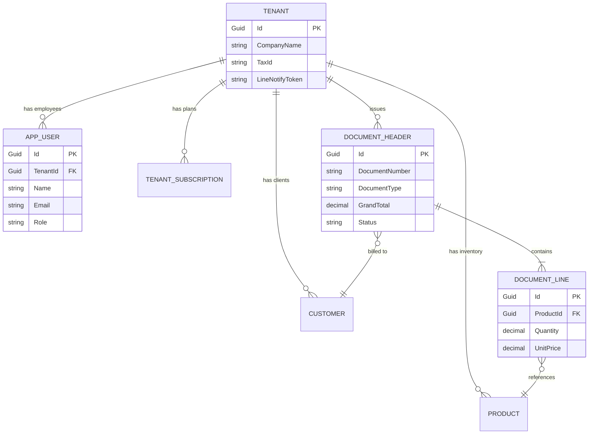

# 📚 เอกสารการพัฒนาระบบ Senic Billing Next (System Documentation)

## 1. 🌟 ภาพรวมของระบบ (System Overview)
**Senic Billing Next** เป็นแพลตฟอร์มการจัดการเอกสารทางการเงินและระบบบิลลิ่ง (SaaS Billing Platform) ที่ถูกออกแบบมาเพื่อรองรับการใช้งานของธุรกิจ SME และองค์กรขนาดเล็ก-กลาง (B2B SaaS) ระบบมีความสามารถตั้งแต่การออกเอกสาร (ใบเสนอราคา, ใบกำกับภาษี, ใบเสร็จรับเงิน, บิลเงินสด, ใบส่งของ) ไปจนถึงการบริหารจัดการสต็อกสินค้า (Inventory) และฐานข้อมูลลูกค้า (CRM)

จุดเด่นของแพลตฟอร์มคือถูกพัฒนาด้วย **Clean Architecture** และ **Multi-Tenant Architecture** (Row-level Isolation) ซึ่งช่วยให้ผู้ให้บริการระบบ (Platform Provider) สามารถให้บริการลูกค้าหลายบริษัท (Tenants) ภายในฐานข้อมูลเดียวกันได้อย่างปลอดภัยและแยกข้อมูลออกจากกันอย่างเด็ดขาด นอกจากนี้ยังรองรับการจ่ายเงินรายเดือน (Subscription) ผ่าน **Omise Payment Gateway**

---

## 2. 📁 โครงสร้างโปรเจกต์ (Project Structure)
ระบบถูกแบ่งออกเป็น 3 ส่วนหลัก (Monorepo-style structure):

```text
senic-billing-next/
├── backend/                              # .NET 10 Backend API (Clean Architecture)
│   ├── src/SenicBilling.Domain/          # Core: Entities, Enums, Interfaces, Exceptions
│   ├── src/SenicBilling.Application/     # Logic: Use Cases, DTOs, Services, Interfaces
│   ├── src/SenicBilling.Infrastructure/  # External: EF Core DbContext, Omise Integration, MailKit, MinIO
│   ├── src/SenicBilling.API/             # Presentation: Controllers, JWT Auth, SignalR Hubs
│   └── Dockerfile                        # Multi-stage Docker build สำหรับ Backend
│
├── frontend/                             # React 19 SPA (SME Tenant Portal)
│   ├── src/
│   │   ├── components/                   # UI Components (auth, dashboard, documents, settings)
│   │   ├── pages/                        # Page Routes
│   │   ├── store/                        # Zustand stores (Auth, Locale, Theme)
│   │   └── services/                     # Axios API Clients
│   ├── nginx.conf                        # Reverse Proxy configuration
│   └── Dockerfile                        # Multi-stage Docker build สำหรับ Frontend
│
├── admin-frontend/                       # React 19 SPA (Super Admin / Provider Portal)
│   ├── src/
│   │   ├── components/                   # Admin UI Components (tenants, plans, usage)
│   │   ├── pages/                        # Admin Routes
│   │   └── services/                     # Admin API Clients
│   └── Dockerfile                        # Multi-stage Docker build สำหรับ Admin Frontend
│
├── .github/workflows/ci-cd.yml           # GitHub Actions (CI/CD Pipeline)
├── docker-compose.yml                    # Portainer Deployment Stack (Services, Database, MinIO)
└── stack.env                             # Environment Variables
```

---

## 3. 💻 เทคโนโลยีที่ใช้ (Tech Stack)

### 🚀 Backend
- **Framework:** .NET 10 (ASP.NET Core Web API)
- **Architecture:** Clean Architecture, Dependency Injection
- **ORM:** Entity Framework Core 10 (Npgsql)
- **Database:** PostgreSQL 16 (Relational Database รองรับ JSONB)
- **Object Storage:** MinIO (S3-compatible) สำหรับเก็บไฟล์และเอกสารแนบ
- **Authentication:** JWT Bearer (JSON Web Token) + Role-based Access Control (RBAC)
- **Real-time Communication:** Microsoft SignalR (WebSockets)
- **Third-party Integrations:** 
  - Omise.Net (Payment Gateway)
  - MailKit (SMTP Email)
  - ClosedXML (Excel Reports Export)

### 🎨 Frontend (Tenant & Admin Portal)
- **Framework:** React 19 (TypeScript) + Vite
- **Styling:** Tailwind CSS v4 (Glassmorphism & CSS Variables for Themes)
- **State Management:** Zustand
- **Routing:** React Router v7
- **Internationalization:** i18next & react-i18next (Multi-language Support)
- **Icons:** Lucide React
- **Notifications:** Web Push API (VAPID)

### ⚙️ DevOps & Deployment
- **Containerization:** Docker & Docker Compose
- **Orchestration:** Portainer (Webhook Deployments)
- **CI/CD:** GitHub Actions (Build and push to GitHub Container Registry `ghcr.io`)

---

## 4. 🎯 ฟีเจอร์หลัก (Key Features)

### 🏢 4.1 SaaS & Multi-Tenancy
- **Tenant Management:** สมัครสมาชิกบริษัทใหม่ (Onboarding) ข้อมูลทุกอย่างจะถูกผูกกับ `TenantId` และป้องกันการมองเห็นข้ามบริษัทด้วย EF Core Global Query Filter
- **Subscription Plans:** ระบบแพ็กเกจค่าบริการรายเดือน (Free, Basic, Pro, Enterprise) ผูกกับ Omise API (Create Customer & Card Charge)
- **Super Admin Dashboard:** แดชบอร์ดเฉพาะสำหรับผู้ให้บริการ เพื่อดูภาพรวมลูกค้า, สถิติรายได้, โควต้าการใช้งาน และระงับการใช้งานลูกค้า (Suspend)

### 📄 4.2 Document Management & Billing
- **Dynamic Documents:** สร้างเอกสาร 5 ประเภท: ใบกำกับภาษี, ใบเสร็จรับเงิน, ใบเสนอราคา, บิลเงินสด, ใบส่งของ
- **Tax Calculation:** รองรับระบบ VAT แบบ Inclusive (รวมภาษี) และ Exclusive (แยกภาษี) รวมถึง ภาษีหัก ณ ที่จ่าย (Withholding Tax)
- **e-Tax XML Generation:** สร้างไฟล์เอกสาร e-Tax แบบ XML ตามมาตรฐาน UN/CEFACT พร้อมส่งกรมสรรพากร
- **Recurring Invoices:** ระบบตั้งเวลาออกบิลซ้ำอัตโนมัติ (Background Worker)

### 🤝 4.3 Collaboration & Integrations
- **Role-based Access Control (RBAC):** กำหนดสิทธิ์พนักงานภายใน Tenant (Admin, Accountant, Sales, User)
- **LINE Integration:** ผูก LINE Notify Token ขององค์กรเพื่อรับการแจ้งเตือนยอดชำระเงิน และมีฟีเจอร์แชร์ลิงก์เอกสารให้ลูกค้าผ่านแอป LINE (Share to LINE)
- **Excel Tax Reports:** ดาวน์โหลดรายงานภาษีขายประจำเดือนเป็นไฟล์ `.xlsx` (ใช้งานร่วมกับฝ่ายบัญชีได้ทันที)

---

## 5. 🔌 API Documentation (อ้างอิง Endpoints หลัก)

ระบบใช้งาน RESTful API พร้อมด้วย `Authorization: Bearer <token>` ทุก Endpoints (ยกเว้น Login/Register)

### 🔑 1. Authentication (`/api/auth`)
- `POST /api/auth/login` - เข้าสู่ระบบและรับ JWT + Refresh Token
- `POST /api/auth/register` - สร้างบัญชีผู้ใช้งานใหม่ภายในองค์กร

### 🏢 2. Tenant & Organization (`/api/tenants`)
- `GET /api/tenants/current` - ดึงข้อมูลโปรไฟล์บริษัทที่กำลังล็อกอิน
- `PUT /api/tenants/profile` - อัปเดตข้อมูลบริษัท (ที่อยู่, ชื่อบริษัท, TaxID, LINE Notify Token, Logo)

### 👥 3. Tenant Users (Staff Management) (`/api/tenant-users`)
- `GET /api/tenant-users` - ดึงรายชื่อพนักงานทั้งหมดในองค์กร
- `POST /api/tenant-users` - เชิญพนักงานใหม่ (สร้าง User ผูกกับ Tenant)
- `PUT /api/tenant-users/{id}/role` - ปรับเปลี่ยนสิทธิ์ (Role: Admin, Sales, Accountant, User)
- `DELETE /api/tenant-users/{id}` - ยกเลิกการเข้าถึงของพนักงาน (Soft Delete)

### 💳 4. SaaS Subscription (`/api/tenant-subscriptions`)
- `GET /api/tenant-subscriptions/current` - ดึงสถานะแพ็กเกจปัจจุบันและวันหมดอายุ
- `POST /api/tenant-subscriptions/checkout` - สร้างรายการชำระเงินตัดบัตรเครดิตผ่าน Omise ด้วย `omiseToken`

### 📄 5. Documents (Tax Invoices example: `/api/tax-invoices`)
- `GET /api/tax-invoices` - ดึงรายการใบกำกับภาษีทั้งหมด (รองรับ Pagination & Search)
- `GET /api/tax-invoices/{id}` - ดึงรายละเอียดใบกำกับภาษี 1 ใบพร้อมรายการสินค้า (Lines)
- `POST /api/tax-invoices` - สร้างร่าง (Draft) ใบกำกับภาษีใหม่
- `PUT /api/tax-invoices/{id}` - อัปเดตรายละเอียดใบกำกับภาษี (เฉพาะสถานะ Draft)
- `DELETE /api/tax-invoices/{id}` - ยกเลิก (Cancel) ใบกำกับภาษี (ต้องระบุเหตุผล)
- `GET /api/tax-invoices/{id}/e-tax-xml` - ส่งออกไฟล์ e-Tax XML มาตรฐาน UN/CEFACT

### 📊 6. Reports (`/api/reports`)
- `GET /api/reports/tax-invoices/excel` - สร้างไฟล์ Excel รายงานภาษีขาย โดยรับ Query Params `month` และ `year`

### 📦 7. Master Data
- `GET, POST, PUT /api/customers` - จัดการฐานข้อมูลลูกค้าเป้าหมาย
- `GET, POST, PUT /api/products` - จัดการฐานข้อมูลสินค้าและบริการ (Inventory & SKU)

### 👑 8. Super Admin Operations (`/api/admin/...`)
*(เข้าถึงได้เฉพาะ Role: SystemAdmin / Platform Provider)*
- `GET /api/admin/tenants` - ดูรายชื่อบริษัท/ลูกค้าทั้งหมดในแพลตฟอร์ม
- `PUT /api/admin/tenants/{id}/status` - ระงับการเข้าถึง (Suspend) หรือเปิดใช้งาน Tenant
- `GET /api/admin/plans` - จัดการราคาแพ็กเกจ (Subscription Plans)
- `GET /api/admin/users` - ดึงบัญชีผู้ใช้งานระบบแบบ Global

---

## 6. 📊 Architecture Diagrams (ER & Workflow)

### 🧩 6.1 Database Entity Relationship (ER Diagram)
แผนภาพแสดงความสัมพันธ์ของฐานข้อมูลหลักภายใต้สถาปัตยกรรมแบบ Multi-Tenant:



### 🔄 6.2 Core Business Workflow (การออกบิลและรับชำระเงิน)
แผนภาพแสดงกระบวนการทำงานตั้งแต่การสร้างเอกสาร, รับชำระเงินผ่าน Omise และแจ้งเตือนผ่าน LINE:

```mermaid
flowchart TD
    A([SME Staff Login]) --> B{เลือกดำเนินการ}
    B -->|สร้างใบแจ้งหนี้| C[สร้าง Draft Invoice]
    C --> D[เลือก Customer และ Products]
    D --> E[อนุมัติ/ออกเอกสาร (Issue)]
    
    E --> F{วิธีการรับชำระเงิน}
    F -->|โอนเงิน/เงินสด| G[พนักงานยืนยันการรับชำระ]
    F -->|บัตรเครดิต| H[สร้าง Payment Link (Omise)]
    
    H --> I[ลูกค้าปลายทางชำระเงินผ่านระบบ]
    I --> J[Webhook อัปเดตสถานะเป็น Paid อัตโนมัติ]
    
    G --> K[สร้าง Receipt / e-Tax XML]
    J --> K
    
    K --> L[ส่งแจ้งเตือนผ่าน LINE Notify]
    L --> M([เสร็จสิ้นกระบวนการ])
```

---

*(หมายเหตุ: เอกสารฉบับนี้อ้างอิงจากโครงสร้างจริงของ Source Code ปัจจุบัน รวมถึงฟีเจอร์พรีเมียมล่าสุดที่มีการพัฒนาเข้าไป)*
