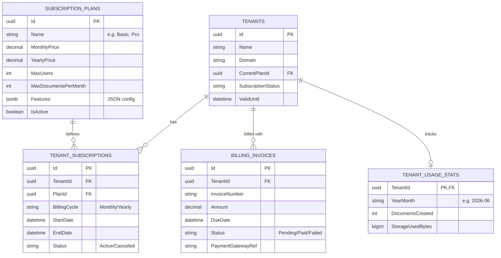

# 🗄️ ออกแบบฐานข้อมูลสำหรับระบบ Package & Subscription (SaaS)

เพื่อให้ระบบ **Senic Billing Next** สามารถคิดค่าบริการลูกค้า (SME) ได้อย่างเป็นระบบและยืดหยุ่น โครงสร้างฐานข้อมูลจะต้องรองรับการเติบโต การอัปเกรด/ดาวน์เกรดแพ็กเกจ และการจัดการโควต้า (Quotas) ได้

ต่อไปนี้คือสถาปัตยกรรมฐานข้อมูลที่แนะนำสำหรับการบริหารจัดการระบบเช่าใช้ (SaaS Subscriptions) ครับ:

---

## 📊 ER Diagram (Entity-Relationship)

---

## 📝 รายละเอียดของแต่ละตาราง (Table Definitions)

### 1. `SubscriptionPlans` (ตารางจัดการแพ็กเกจหลัก)
ตารางนี้ Super Admin จะเป็นคนจัดการ เพื่อสร้างหรือปรับปรุงแพ็กเกจที่เปิดขาย
* `Id` (UUID): รหัสแพ็กเกจ
* `Name` (String): ชื่อแพ็กเกจ เช่น "Free", "Basic", "Pro"
* `MonthlyPrice` / `YearlyPrice` (Decimal): ราคาค่าบริการ
* `MaxUsers` (Int): จำนวนผู้ใช้งานสูงสุดที่สร้างได้ในระบบ
* `MaxDocumentsPerMonth` (Int): โควต้าการออกเอกสารต่อเดือน (-1 = ไม่จำกัด)
* `Features` (JSONB): เก็บข้อมูลฟีเจอร์อื่นๆ แบบยืดหยุ่น เช่น `{"hasApi": true, "hasOmise": false}`
* `IsActive` (Boolean): เปิดขายอยู่หรือไม่

### 2. `Tenants` (ส่วนขยายของตารางองค์กรเดิม)
ตารางบริษัทลูกค้า (SME) ซึ่งเดิมมีข้อมูลชื่อบริษัทอยู่แล้ว ให้เพิ่มฟิลด์ที่เกี่ยวกับสถานะการเช่าใช้เข้าไป
* `CurrentPlanId` (UUID - FK): แพ็กเกจปัจจุบันที่ลูกค้าใช้งานอยู่
* `SubscriptionStatus` (Enum/String): สถานะปัจจุบัน ได้แก่
  - `Trial`: ช่วงทดลองใช้
  - `Active`: จ่ายเงินและใช้งานปกติ
  - `PastDue`: ค้างชำระเงิน (ยังให้เข้าสู่ระบบได้แต่อาจล็อคบางฟีเจอร์)
  - `Suspended`: ระงับการใช้งาน
* `ValidUntil` (DateTime): วันที่รอบบิลปัจจุบันหมดอายุ

### 3. `TenantSubscriptions` (ประวัติการเช่าแพ็กเกจ)
ตารางนี้สำคัญมากสำหรับเก็บ **"ประวัติ"** การใช้งานแพ็กเกจ เช่น ลูกค้าเคยใช้ Basic แล้วอัปเกรดเป็น Pro
* `TenantId` (UUID - FK): รหัสบริษัท
* `PlanId` (UUID - FK): รหัสแพ็กเกจ
* `BillingCycle` (String): `Monthly` (รายเดือน) หรือ `Yearly` (รายปี)
* `StartDate` / `EndDate` (DateTime): รอบของแพ็กเกจนี้
* `Status` (String): `Active`, `Canceled`, `Expired`

### 4. `BillingInvoices` (บิลเรียกเก็บเงินที่ Platform ส่งให้ SME)
เป็นบิลค่าบริการที่ระบบของคุณ (ผู้ให้บริการ) ออกให้ลูกค้า
* `InvoiceNumber` (String): เลขบิล เช่น `SAAS-2606-001`
* `Amount` (Decimal): ยอดเรียกเก็บ
* `DueDate` (DateTime): วันครบกำหนดชำระ
* `Status` (String): `Pending` (รอชำระ), `Paid` (ชำระแล้ว), `Failed` (ตัดบัตรไม่ผ่าน)
* `PaymentGatewayRef` (String): เก็บ Charge ID ของ Omise เผื่อเกิดปัญหาจะได้ตรวจสอบกับระบบ Payment ได้

### 5. `TenantUsageStats` (สถิติการใช้งานสำหรับนับ Quota)
เพื่อป้องกันปัญหาการดึงข้อมูลทั้ง Database มานับว่าลูกค้าออกบิลไปกี่ใบแล้ว (ซึ่งกิน Resource มาก) เราควรมีตารางเก็บสถิติแยก
* `TenantId` (UUID)
* `YearMonth` (String): เก็บรูปแบบ `YYYY-MM` เช่น `2026-06`
* `DocumentsCreated` (Int): จำนวนเอกสารที่สร้างไปแล้วในเดือนนี้
* `StorageUsedBytes` (BigInt): ปริมาณพื้นที่ไฟล์แนบที่ใช้ไป

> **💡 การทำงานของระบบโควต้า (Quota Workflow):**
> ทุกครั้งที่ SME กด "บันทึก" บิลเงินสดหรือใบกำกับภาษี ระบบจะไปเช็ค `TenantUsageStats` เทียบกับ `SubscriptionPlans.MaxDocumentsPerMonth` ก่อน หากยังไม่เกินโควต้า ก็จะสร้างเอกสารให้ และอัปเดตค่า `DocumentsCreated + 1` ไปพร้อมๆ กัน (ทำใน Transaction เดียวกัน)

---

**ความคิดเห็นเบื้องต้น:**
โครงสร้างนี้จะทำให้คุณสามารถขยายสเกลธุรกิจ SaaS ได้อย่างสบายๆ ในอนาคต ไม่ว่าลูกค้าจะอัปเกรด ดาวน์เกรด หรือต่ออายุแพ็กเกจ ข้อมูลทั้งหมดจะถูกจัดการอย่างเป็นระบบ และมีประวัติตรวจสอบได้ทั้งหมดครับ 

คุณมีความคิดเห็นอย่างไรเกี่ยวกับโครงสร้างของฟิลด์ `Features` (ที่เก็บเป็น JSON) แบบนี้ไหมครับ? หรืออยากให้เจาะจงฟีเจอร์เป็นคอลัมน์ไปเลยเพื่อความชัดเจน?
